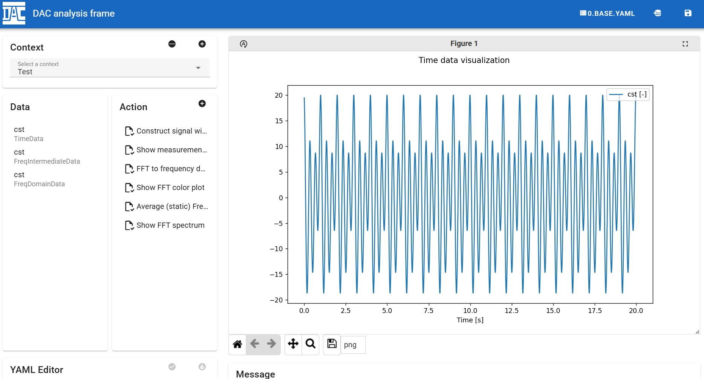

# DAC web


[DAC](http://github.com/miziper/dac.git) web version, which enables data processing via web browser with DAC frame way of working.

## Introduction



## Deploy

To use the application, pack the backend and frontend into a container image with `docker` or `podman`.

```bash
podman build -t dac_web .
```

The default container image is also available at <https://hub.docker.com/r/miziper/dac_web>.

```bash
podman pull docker.io/miziper/dac_web
```

### Command to setup

```bash
podman run -p 5000:5000 dac_web
```

### Storage structure

The analysis settings are stored under `/app/projects/` with json format.